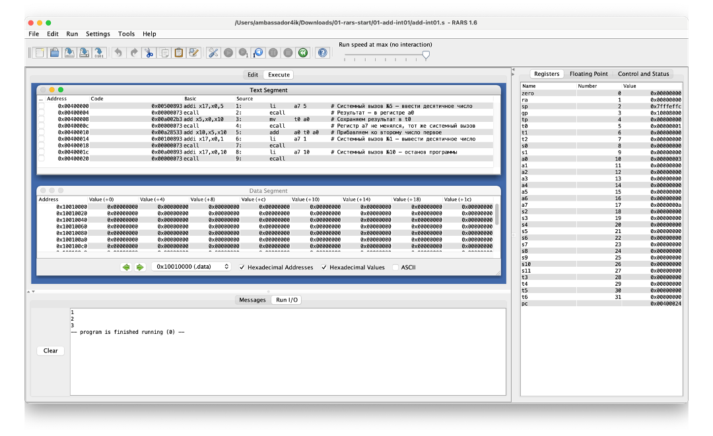
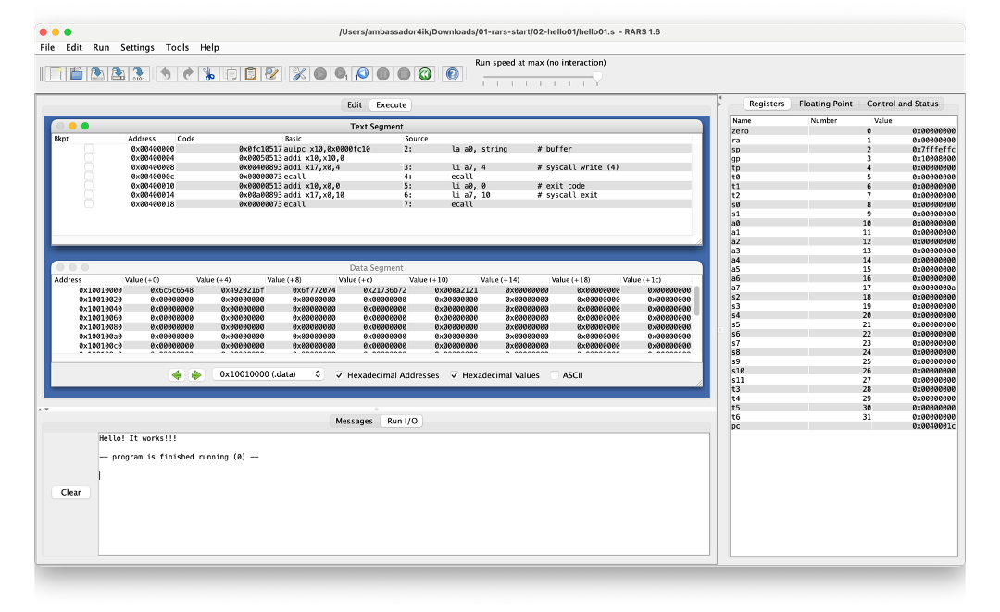
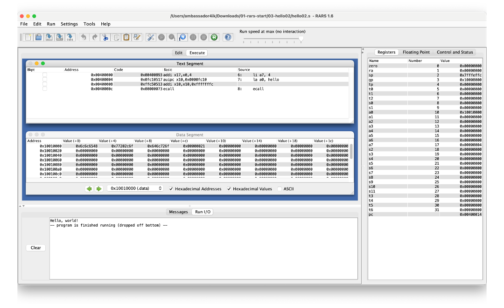
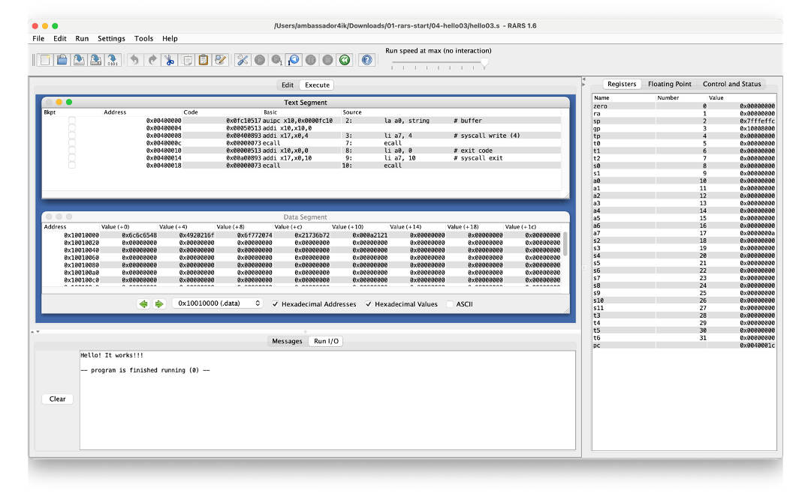
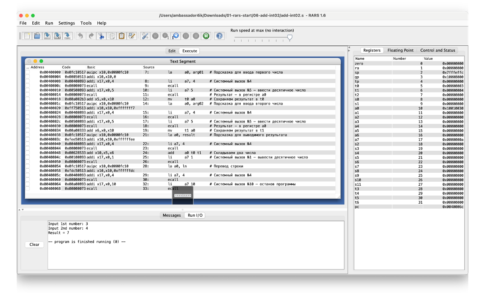

# ДЗ #1
## Работа с RARS

### Программа #1

Видим, что `li` и `mv` - псевдокоманды: они реализованы через сложение с `x0`.

### Программа #2

Здесь добавляется псевдокоманда `la`.

### Программа #3

Проанализируем код программы:
```assembly
    .data
hello:
    .asciz "Hello, world!"
    .text
main:
    li a7, 4 # addi: immediate
    la a0, hello # auipc: upper immediate
    ecall
```

### Программа #4


### Программа #5


### Программа #6


### Системные вызовы
`addi`, `add`, `auipc`.
