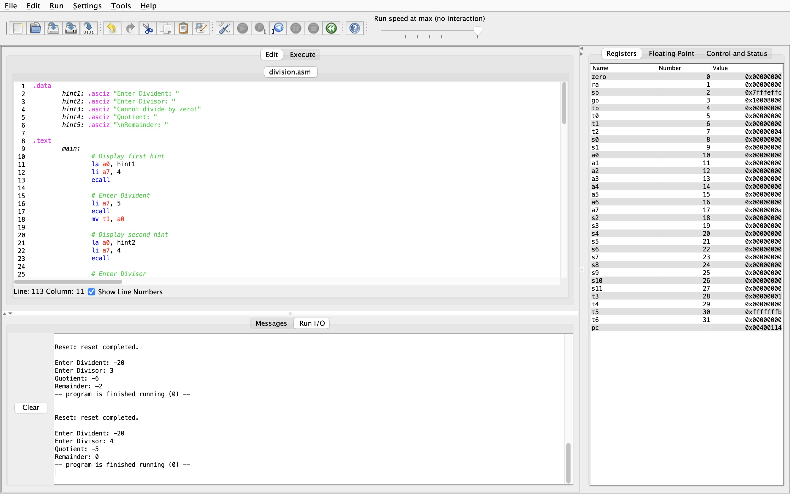

# ДЗ #2
## Реализация простого алгоритма

Код программы находится в файле `division.asm`.\
Скриншот тестирования программы:

Лог тестирования программы:
```
Enter Divident: 0
Enter Divisor: 5
Quotient: 0
Remainder: 0
-- program is finished running (0) --


Reset: reset completed.

Enter Divident: -5
Enter Divisor: 0
Cannot divide by zero!
-- program is finished running (0) --


Reset: reset completed.

Enter Divident: 21
Enter Divisor: 4
Quotient: 5
Remainder: 1
-- program is finished running (0) --


Reset: reset completed.

Enter Divident: -21
Enter Divisor: -4
Quotient: 5
Remainder: -1
-- program is finished running (0) --


Reset: reset completed.

Enter Divident: -20
Enter Divisor: -4
Quotient: 5
Remainder: 0
-- program is finished running (0) --


Reset: reset completed.

Enter Divident: 20
Enter Divisor: -3
Quotient: -6
Remainder: 2
-- program is finished running (0) --


Reset: reset completed.

Enter Divident: -20
Enter Divisor: 3
Quotient: -6
Remainder: -2
-- program is finished running (0) --


Reset: reset completed.

Enter Divident: -20
Enter Divisor: 4
Quotient: -5
Remainder: 0
-- program is finished running (0) --
```

