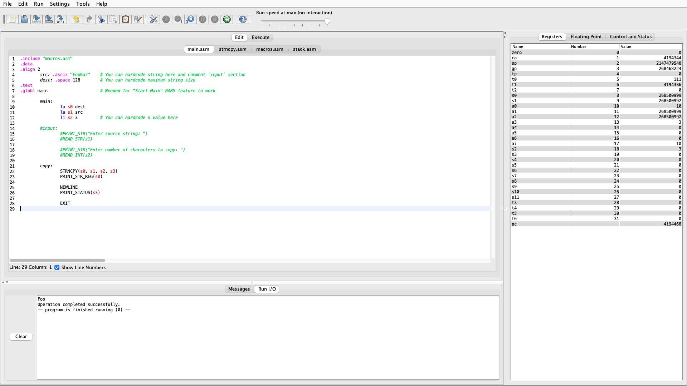

# ДЗ # 6
## Обработка строк символов. Копирование строки

Код программы находится в папке [src](src).\
Лог тестирования программы находится в файле [test.log](test.log).

Тестирование программы с использованием строк символов выглядит так:

P.S. Программа не проверяет переполнение буфера (что язык C тоже не делает). Чтобы это сделать, можно просто передавать размер буфера как аргумент или придумать что-то еще, но этого в задании не просили. Равно как и динамическое выделение памяти под строки.